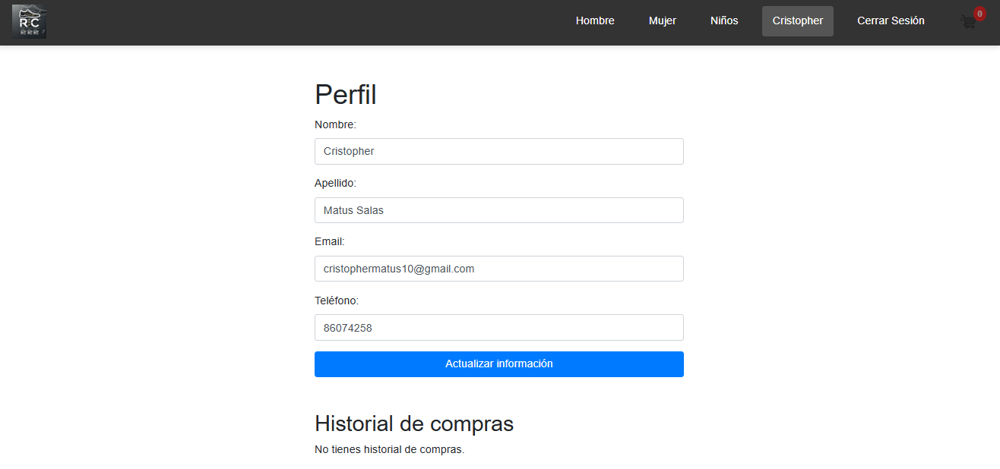

1-Instalación del Proyecto
Descargar el proyecto:

Si has descargado el archivo .zip, descomprímelo en la ubicación donde desees instalar el proyecto.
Configuración del Servidor:

2-Copia el contenido descomprimido en el directorio raíz de tu servidor web. Por ejemplo, si estás usando XAMPP, colócalo en C:\xampp\htdocs\RC.

3-Configuración de la Base de Datos:

Importa el archivo online_store.sql en tu gestor de bases de datos.
Abre phpMyAdmin y selecciona la base de datos que deseas utilizar, luego utiliza la opción "Importar" para cargar el archivo online_store.sql.
Asegúrate de que las credenciales de la base de datos en el proyecto coincidan con las de tu entorno. Esto usualmente se configura en un archivo db_connect.php dentro del directorio db.

4-Configuración de Archivos:

Revisa los archivos en el directorio db para asegurarte de que la conexión a la base de datos esté correctamente configurada.
Si necesitas ajustar las rutas, verifica los archivos de configuración, generalmente encontrados en el directorio db.

5-Iniciar el Proyecto:

Asegúrate de que el servidor web esté corriendo.
Abre un navegador web y navega a http://localhost/RC (o la ruta que hayas configurado en tu servidor).

6-Estructura de Archivos y Directorios

- controller/: Contiene los controladores que manejan la lógica de la aplicación.
- css/: Incluye archivos de estilo CSS que definen la apariencia del sitio.
- db/: Tiene la configuraciones específicas para la base de datos o scripts adicionales.
- images/: Directorio donde se almacenan todas las imágenes utilizadas en la aplicación.
- includes/: Almacena los archivos que son comúnmente incluidos en múltiples páginas, como cabeceras, pies de página, o scripts de configuración.
- pages/: Aquí se encuentran las páginas web individuales del sitio, como el inicio, productos, contacto, etc.

7-Uso y Navegación por el Sitio Web

Página de Inicio:

Navega a la página principal para ver una vista general de la tienda.

8- Páginas de Productos:

Accede a las distintas páginas de productos para explorar las categorías disponibles.

9-Pagina carrito de compras:
Donde decides si eliminar algo del carrito antes de hacer los metodos de pagos de Paypal.

10-Pagina perfil de Usuario:
Muestra el perfil registrado donde podras cambiar tú informacion si lo deceas y podras ver tú historial de compras que tines con este perfil.
